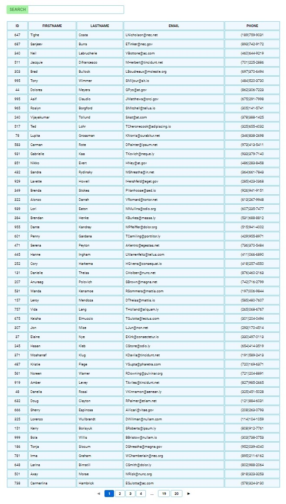

# Test App React JS

This project was bootstrapped with [Create React App](https://github.com/facebook/create-react-app).

- Simple application which fetches the data and render it to table.
- Sorting implemented on each of columns.
- Selection of what size of data will be downloaded.
- Pagination with `react-paginate` package.
- Filtering with input for searching of substring.

## Available Scripts

In the project directory, you can run:

### `npm start`

Runs the app in the development mode.\
Open [http://localhost:3000](http://localhost:3000) to view it in your browser.

## Screenshot

